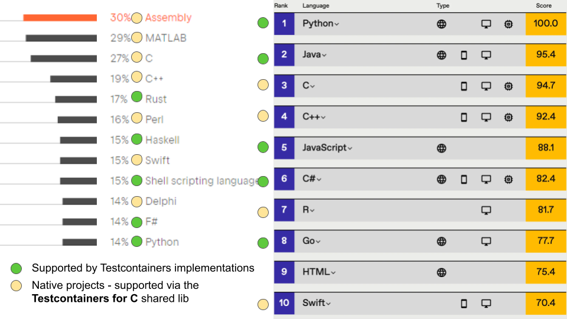

# Testcontainers for C/C++/Swift and other native languages

<p align="center">
  
</p>

[](http://slack.testcontainers.org/)
[](https://masterminds.github.io/stability/experimental.html)
[](https://github.com/oleg-nenashev/testcontainers-c/releases)

!!! warning
    This is a prototype.
    There is a lot to do before it can be distributed and used in production, see the GitHub Issues
    and the [project roadmap](./ROADMAP.md)

This is not a standalone [Testcontainers](https://testcontainers.org/) engine,
but a C-style shared library adapter for native languages like C/C++, D, Lua, Swift, etc.
It is an MVP SDK that can be later extended for the languages.
The project is based on [Testcontainers for Go](https://golang.testcontainers.org/)
which is one of the most powerful Testcontainers implementations.

Contributions and feedback are welcome!
Also join the `#testcontainers-native` channel on the [Testcontainers Slack](http://slack.testcontainers.org/).

## Key Features

- _Testcontainers for C/C++_ - a shared library and C-style headers that can be used in native projects
- Support for [C](./docs/c/README.md), [C++](./docs/cpp/README.md), [Swift](./docs/swift/README.md) and other native projects.
- Minimum viable Testcontainers API functionality:
  starting and terminating containers, passing files, exposing ports,
  accessing container logs, etc.
- Minimum HTTP client wrapper to simplify requests and assertions
- [Testcontainers for Go](https://golang.testcontainers.org/) under the hood, with all its reporting and resource management capabilities.
  Memory might leak a lot in the current versions, but we do not want containers to leak :)
- Support for [Testcontainers Modules](./modules/README.md)

This is what a very simple run without a test framework may look like.

[](./demo/wiremock/README.md)

## Quick Start

Follow the [Getting Started Guide](./docs/getting-started.md).

### Installing the library

It is advised to include CMake as a dependent module for now.
If you like living dangerously until proper vcpkg and Conan packages are ready,
you can optionally install the library to your system:

```bash
# NOT RECOMMENDED
cmake --install ..
```

## Documentation

### Using in C/C++/Swift projects

- [C projects](./docs/c/README.md)
- [C++ projects](./docs/cpp/README.md)
- [Swift projects](./docs/swift/README.md)

See [the examples and demos](./demo/README.md) for more examples.

### Using in other languages

TL;DR: You get the C header file, a shared library object or a DLL file from the
[Testcontainers for C](./docs/c/README.md) module.
Then, you can bind this native library in your project type.
It allows supporting many other languages that support using
native tooling via dynamically or statically linked libraries:



Disclaimer:
The schema above shows the most popular languages for Embedded systems,
based on the
[IEEE Spectrum 2021 Report](https://spectrum.ieee.org/top-programming-languages-2021)
and the [JetBrains 2021 Developer Ecosystem Survey for Embedded Software](https://www.jetbrains.com/lp/devecosystem-2021/embedded/).
More native languages exist and can be supported by Testcontainers Native.

Feel free to contribute examples or SDKs for the languages!
See the [Swift Solution Page](./docs/swift/README.md) for examples.
[Testcontainers Native Architecture](./docs/architecture/README.md)
describes how it can be done in principle.

## Credits

Using a complex Golang framework from C/C++ is not trivial.
Neither the CMake files are.
This project would not succeed without many quality articles
and help from the community.

Kudos to:

- All Testcontainers, Golang C-Shared build mode, CGO and WireMock contributors!
- [Manuel de la Peña](https://github.com/mdelapenya) for maintaining [Testcontainers for Go](https://github.com/testcontainers/testcontainers-go) and answering bizarre questions about the implementations `:-)`
- [Vladimir Vivien](https://github.com/vladimirvivien) for
  [Calling Go Functions from Other Languages using C Shared Libraries](https://github.com/vladimirvivien/go-cshared-examples)
- [Ben McClelland](https://twitter.com/hpc_ben) for
   [An Adventure into CGO - Calling Go code with C](https://medium.com/@ben.mcclelland/an-adventure-into-cgo-calling-go-code-with-c-b20aa6637e75)
- [Insu Jang](https://github.com/insujang) for
  [Implementing Kubernetes C++ Client Library using Go Client Library](https://insujang.github.io/2019-11-28/implementing-kubernetes-cpp-client-library)
- Infinite number of StackOverflow contributors

## Discuss

For any questions and feedback,
join the `#testcontainers-native` channel on the [Testcontainers Slack](http://slack.testcontainers.org/).

## Support the Project

The best support is investing some time in the project.
All contributions are welcome, checkout the [Contributor Guide](./CONTRIBUTING.md).
Of course, [GitHub Sponsorships](https://github.com/sponsors/oleg-nenashev) will be appreciated too.

## Read More

- [Testcontainers](https://testcontainers.org/)
- [WireMock and Testcontainers](https://wiremock.org/docs/solutions/testcontainers/)
- [Testcontainers Modules](https://testcontainers.com/modules)
- [WireMock modules for Testcontainers](https://testcontainers.com/modules/wiremock/)
